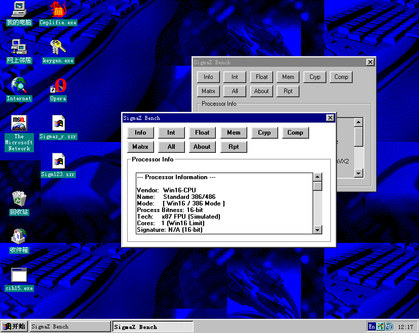
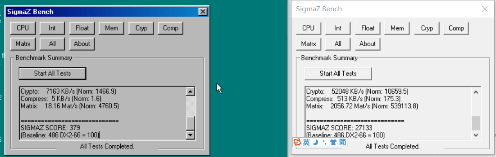

# SigmaZ - The Generic PC Processor Performance Evaluation Utility

[中文文档 (Chinese)](README_CN.md) | [Documentation (English)](docs/en/index.md)

**SigmaZ** is a benchmarking utility for Windows systems, supporting environments from **Windows 3.1** to **Windows 11**. It compiles to native Win16, Win32 and Win64 executables to run on hardware ranging from 486 PCs to modern multi-core workstations.

## Key Features

*   **Multi-Platform**: Native executables for Win16 (286/386/486), Win32 (Win9x/NT), and Win64 (Modern x64).
*   **Performance Metrics**: Scores are normalized against a baseline **Intel 486 DX2-66** (100 points).
*   **Comprehensive Tests**: Integer (Pi), Float (Mandelbrot), Memory Ops, Crypto (CRC32), Compression (LZ77), and Matrix Math.
*   **Timeout Strategy**: Integer/Float/Crypto/Compression/Matrix tests are capped at 20 seconds with partial scoring on timeout, while Memory Ops uses a fixed-duration bandwidth window.

For detailed test descriptions and algorithms, please check the [Benchmark Definitions](docs/en/benchmark_defs.md).

## Getting Started

1.  Download the latest release or build from source.
2.  Choose the correct executable for your system:
    *   **`sigma64.exe`**: Modern 64-bit Windows (10/11)
    *   **`sigma32.exe`**: 32-bit Windows (95+)
    *   **`sigma16.exe`**: 16-bit Windows (3.1/3.11)
3.  Run the application and click **Start All Tests**.

Check [Quick Start](docs/en/quick_start.md) for more details.

## Building

SigmaZ requires **Open Watcom v2** (for Win16/32) and **Visual Studio / MSVC** (for Win64).

*   Run `build.bat` to build Win16 and Win32 versions.
*   Run `build_x64.bat` to build the Win64 version.
*   Artifacts are located in the `build/` directory.

See [Technical Details](docs/en/technical.md) for full compilation instructions.

## Documentation

Detailed documentation is available in the `docs/` folder or the compiled CHM help file.

*   [System Requirements & Quick Start](docs/en/quick_start.md)
*   [Benchmark Definitions & Formulas](docs/en/benchmark_defs.md)
*   [Scoring System](docs/en/scoring.md)
*   [Technical Details](docs/en/technical.md)
*   [Troubleshooting](docs/en/troubleshooting.md)

## License

This project is open source. See [LICENSE](LICENSE) for details.

## Project Structure

*   `main.c`: Entry point, UI handling, and test orchestration.
*   `bench.c`: Core integer benchmark (Pi calculation) and threading logic.
*   `bench_*.c`: Specific benchmark implementations (Float, Memory, Crypto, Compress, Matrix).
*   `detect.c`: CPU detection routines (CPUID, etc.).
*   `timer.c`: High-resolution timing wrapper (QueryPerformanceCounter / GetTickCount).
*   `sigmaz.rc`: Resource script defining the GUI layout.
*   `help/`: Source files for the CHM help documentation.

## License

This project is open-source. See the [LICENSE](LICENSE) file for details.

## Disclaimer

This tool puts significant stress on your hardware (`CPU` and `RAM`). While protections are in place, run it at your own risk on unstable or overclocked systems.

---

*Copyright (c) 2026 Ziyang Bai*
